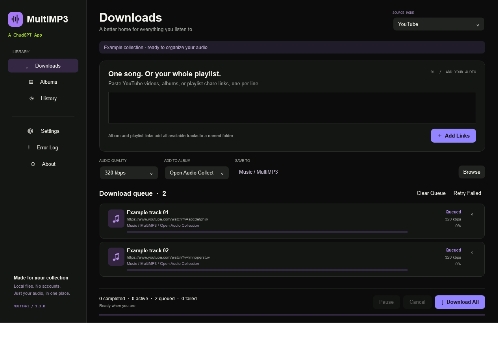
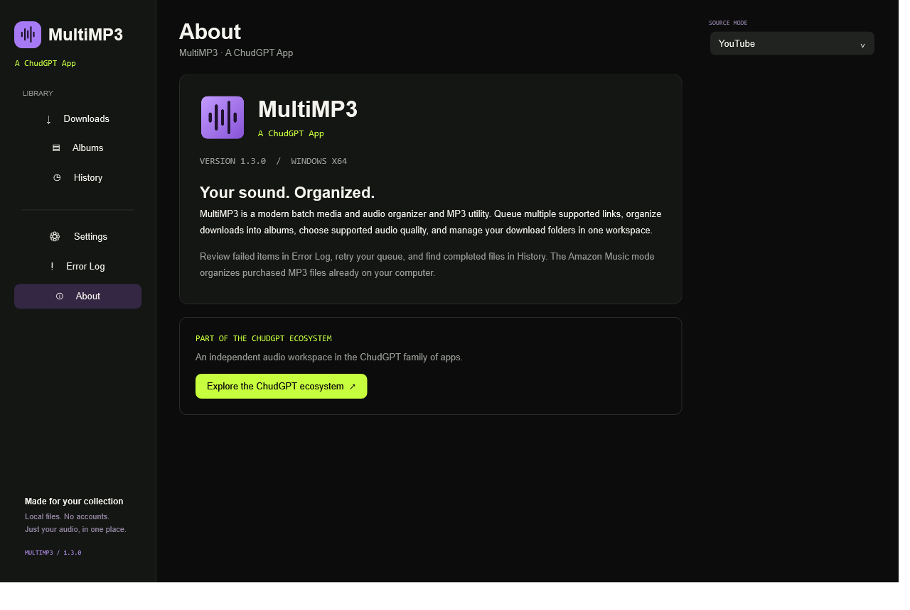
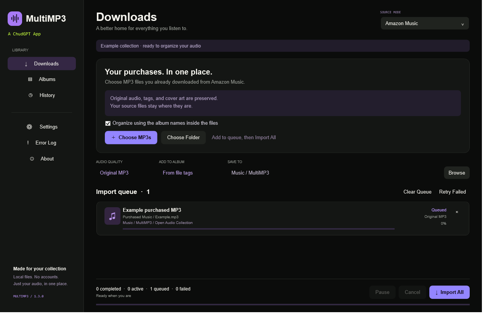

# MultiMP3


**MultiMP3 — A ChudGPT App.** A native Windows workspace for batch audio downloads and an organized MP3 collection.

Version **1.3.0** · Windows x64 · MIT source license

## MultiMP3 Web

MultiMP3 Web is the fast browser edition: paste one or many supported YouTube links, inspect metadata, choose MP3 quality, organize tracks into albums, download a track or album, and export the full library as `MultiMP3_Site_Albums.zip`. Its responsive frontend lives in `web/static`; lightweight queue, album, and quality state stays in browser storage.

The static interface is designed for a separate Vercel project. Media processing cannot run on static hosting: `web/backend` provides the companion Node service for metadata, yt-dlp extraction, FFmpeg conversion, and ZIP creation. The web app connects to the installed local service automatically and does not expose backend configuration to visitors. The backend validates YouTube URLs, sanitizes names, limits requests and archive sizes, bounds processing to one conversion at a time, and cleans temporary files after responses finish.

To run locally, install Node.js 20+, yt-dlp, FFmpeg, and the backend dependencies:

```powershell
cd web/backend
npm install
npm start
```

Then serve `web/static` with any static HTTP server; it automatically connects to `http://127.0.0.1:4783`. On Windows, the packaged backend folder includes Start, Stop, and Restart command files. Copy `Public Site URL.example.txt` to `Public Site URL.txt`, replace its contents with the exact deployed Vercel origin, and restart the backend. The local file is ignored by Git. See [`web/backend/.env.example`](web/backend/.env.example).

API routes:

| Route | Purpose |
| --- | --- |
| `GET /api/health` | Verify the service, yt-dlp, and FFmpeg |
| `POST /api/info` | Read metadata for 1–50 validated YouTube URLs |
| `POST /api/download` | Convert and return one MP3 |
| `POST /api/export` | Build an album ZIP or `MultiMP3_Site_Albums.zip` |

The Vercel frontend does not process media by itself. The included service runs locally on the user's Windows computer; visitors without it can still view and organize the interface, but metadata and downloads remain unavailable. Temporary media is not retained after delivery.

## Overview

Paste supported YouTube links, import an album or playlist, choose audio quality, and manage your queue in one place. MultiMP3 also organizes purchased MP3 files already downloaded to your computer. No account is required by the app.

## Features

- Multiple video links, YouTube Music albums, and public YouTube / YouTube Music playlists.
- Named album folders, ordered tracks, safe filenames, and collision protection.
- MP3 quality choices: 128, 192, 256, 320 kbps, or Best Available VBR.
- Bounded concurrent downloads, pause, cancellation, retries, history, and error details.
- Optional metadata and cover art for converted downloads.
- Amazon Music mode for organizing purchased MP3s from local files or folders, preserving their original bytes, tags, and artwork.
- Persistent settings, albums, queue, and history; interrupted work returns to the queue.
- A compact About view with ChudGPT ecosystem information.

## Screenshots

Actual application captures using synthetic sample data; sample rows are not download recommendations.





## Installation

1. Download `MultiMP3-v1.3.0-Windows-x64.zip` from [GitHub Releases](https://github.com/ASTRA228b/MultiMP3/releases/latest).
2. Extract the entire ZIP to a writable folder and keep its contents together.
3. Run **Setup-Engine.cmd** inside the extracted MultiMP3 folder. It downloads the media tools from upstream and verifies their published SHA-256 checksums. Internet access is required.
4. Open **MultiMP3.exe**. The ZIP includes the .NET runtime.
5. Optionally run **Create-Shortcut.cmd** to add a desktop shortcut.

The executable is currently unsigned. Media tools are installed separately, not redistributed in the public ZIP. Review [third-party notices](THIRD-PARTY-NOTICES.md). Repeat setup when an extractor update is needed, then use **Settings → Recheck Dependencies**.

## Requirements

| Component | Purpose |
| --- | --- |
| Windows 10/11 x64 | Native WPF desktop application |
| Internet access | Tool installation and YouTube metadata/downloads |
| yt-dlp | Supported public media extraction |
| FFmpeg and FFprobe | MP3 conversion and media inspection |
| Node.js 22+ | JavaScript runtime used by YouTube extraction |

Setup installs portable tools beside the app. Alternatively place the executables in `tools` beside MultiMP3.exe or on PATH. Keep FFmpeg and FFprobe together. Local purchased MP3 imports need FFprobe but do not use yt-dlp or re-encode audio.

## How to Use

Choose a destination with **Browse**, paste one supported link per line, and select **Add Links**. Choose quality and an optional album, then **Download All**. Completed items appear in History; failures appear in Error Log.

Supported input includes HTTPS watch, youtu.be, Shorts, completed live recordings, YouTube Music album share links (`OLAK…`), album browse links (`MPRE…` / `MPAD…`), and finite public playlists (`PL…` / `UU…`). Share tracking parameters are removed. A watch link with a playlist parameter still adds only its video. Artist pages, radio mixes, ongoing livestreams, private/authenticated media, and unrelated sites are unsupported.

For **Amazon Music**, switch Source Mode, choose already downloaded purchased MP3s or a folder, then **Import All**. Extract purchase ZIPs first. Album tags optionally group tracks and track numbers determine their order. Untagged files use Amazon Purchases. Files are copied exactly; originals remain untouched. This mode does not sign in to Amazon or download streaming links.

## Albums

Create, open, rename, or delete collections under Albums. Album and playlist links import their available track list into a named collection in source order, including additional playlist pages returned by yt-dlp. Reimporting a collection reuses its identity. Duplicate prompts can skip existing tracks. Unavailable entries are logged where upstream metadata exposes them; YouTube may hide some entries entirely.

Open a collection to use **Download Album** or **Download Playlist**. Folders are created when work starts. Renaming or deleting a collection changes library organization; previously saved audio stays at its existing path. Deleting an album sends its queued items to Unsorted. Filenames are sanitized and numbered rather than overwritten.

## Audio Quality

Best Available uses high-quality variable-bitrate MP3. Higher output bitrates cannot restore quality missing from source audio. Quality changes update queued/failed items in the current view and the default for new links. Local purchased MP3 imports retain original quality regardless of this setting.

## Download Queue

Drag rows to reorder while idle. Pause lets active items finish and holds new work. Cancel stops active processes and returns unfinished work to Queued; restarting begins those items again. Links added during a batch wait for the next run. Failures do not stop remaining items. Overall progress counts completed and failed items as processed, with separate outcome counters.

Duplicate checks compare normalized video URLs or local source paths, not audio fingerprints. Filename collisions always use a unique suffix.

## Error Handling

Error Log shows individual failures and technical details. Use Retry Failed after resolving the cause. Optional automatic retries are configurable. If artwork conversion fails, disable cover art and retry. Missing dependencies are reported at startup and can be rechecked in Settings.

## Settings

Configure default quality, destination, concurrency (1–4), retry count, duplicate prompts, metadata, artwork, and whether to open the output folder after a batch. Settings and library data live at `%LOCALAPPDATA%/MultiMP3/library.json` with an atomic save and recovery backup. The default audio destination is `Music/MultiMP3`.

Set `MULTIMP3_DATA_DIR` to isolate library storage for testing. Do not share your library file in bug reports. The static theme uses ChudGPT charcoal neutrals and lime ecosystem labels with MultiMP3 violet audio controls. There are no decorative animations.

## Building From Source

Install the .NET 9 SDK with Windows desktop support, then run:

```powershell
dotnet build src/MultiMP3/MultiMP3.csproj -c Release
dotnet run --project tests/MultiMP3.Tests.csproj -c Release
powershell -ExecutionPolicy Bypass -File scripts/Build.ps1
powershell -ExecutionPolicy Bypass -File scripts/Setup-Engine.ps1
dotnet run --project tests/MultiMP3.Tests.csproj -c Release -- "$PWD/release/MultiMP3/tools"
powershell -ExecutionPolicy Bypass -File scripts/Package-Release.ps1
```

Build.ps1 creates a local self-contained application under `release/MultiMP3`. Package-Release.ps1 creates a clean public ZIP and SHA-256 file under `artifacts`, including runtime licenses and setup scripts, excluding media tools and user state. Do not distribute your working release folder without reviewing dependency licenses.

UI test/preview harnesses require `-p:EnableUiTests=true` and isolated data directories. Normal production builds exclude them. See [release verification](docs/RELEASE-VERIFICATION.md).

## Project Structure

| Path | Contents |
| --- | --- |
| `src/MultiMP3/MainWindow*.cs`, `MainWindow.xaml`, `App.xaml` | WPF interface, theme, About, and user interactions |
| `src/MultiMP3/Core` | State, collections, URL validation, paths, and import planning |
| `src/MultiMP3/Services` | Queue, process handling, extraction, conversion, and copying |
| `tests` | Executable regression checks, including real FFmpeg fixtures |
| `scripts` | Build, package, upstream tool setup, and shortcut creation |
| `assets`, `docs/images` | MultiMP3 branding and sample-data screenshots |
| `web/static` | Deployable MultiMP3 Web interface |
| `web/backend` | Local processing API and Windows service controls |

## Known Issues

- Windows x64 only; executable is unsigned.
- Media tools require a separate initial setup. Upstream extractor changes and network restrictions can affect downloads.
- No DRM bypass, account sign-in, subscription-streaming imports, or private media access.
- Run one app instance per library; simultaneous instances do not coordinate writes.
- Force-killing the app can leave `.multimp3-*` staging directories under the destination. Remove leftover staging directories only while the app is closed.
- The minimum supported window is 1040 × 720; smaller displays are not supported.
- An official ChudGPT logo asset has not been supplied. Ecosystem identity uses text, retaining the existing MultiMP3 waveform icon.

## Roadmap

Possible future work includes signed releases, automated release builds, and additional accessibility testing. These are plans, not current features or promises.

## License

MultiMP3 source code and original artwork are available under the [MIT License](LICENSE). Dependencies retain their own licenses; see [THIRD-PARTY-NOTICES.md](THIRD-PARTY-NOTICES.md). See [CHANGELOG.md](CHANGELOG.md) for version history and [Issues](https://github.com/ASTRA228b/MultiMP3/issues) for feedback.

## ChudGPT Ecosystem

**MultiMP3** is **A ChudGPT App**, retaining its own audio-focused identity. [Explore the ChudGPT ecosystem](https://chudgpt-landing.vercel.app/). This relationship does not add AI chat functionality.

## Important Legal/Use Note

Only download or organize media you own or have permission to save. Respect applicable terms and rights. MultiMP3 does not bypass DRM or access controls and is not affiliated with YouTube, Google, Amazon, or their music services.
